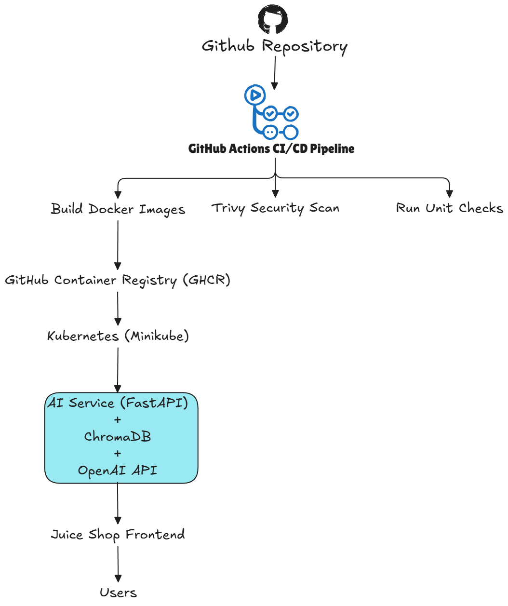
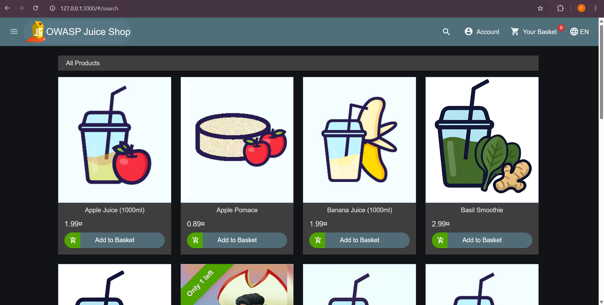
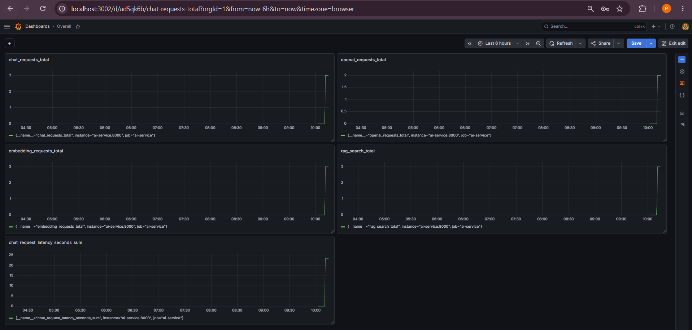
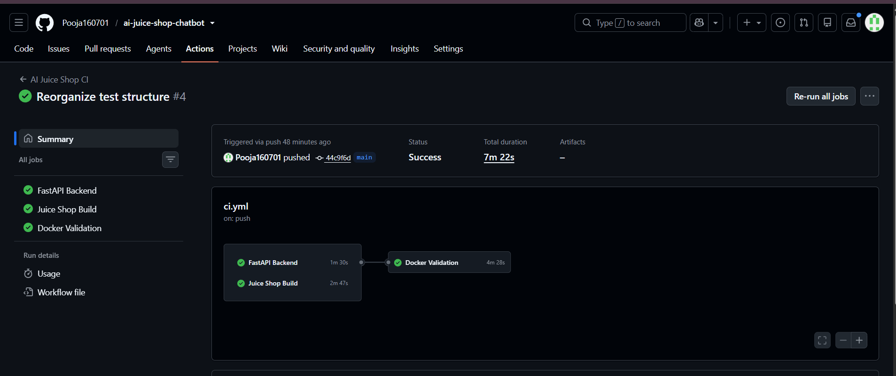
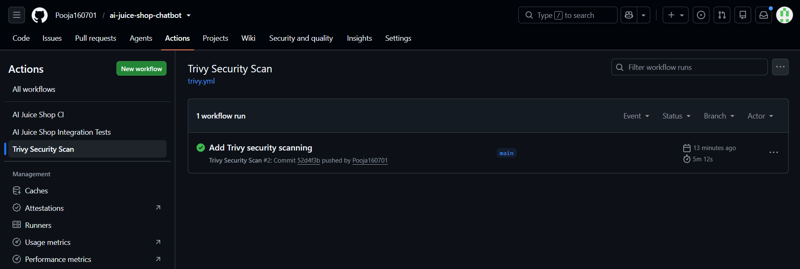
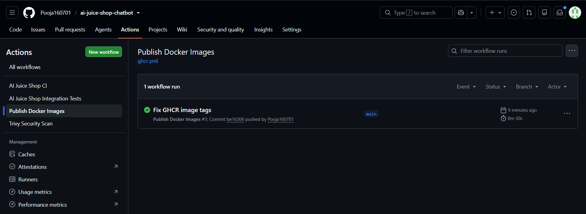
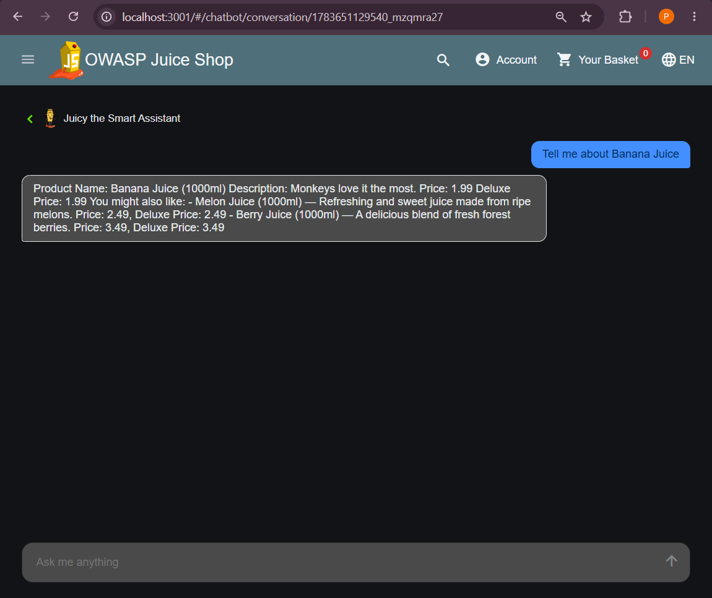

# 🤖 AI-Powered OWASP Juice Shop Assistant


An end-to-end AI-powered assistant for OWASP Juice Shop built using FastAPI, OpenAI, ChromaDB, Docker, Kubernetes, and GitHub Actions.

The project demonstrates production-style deployment engineering practices, including containerization, CI/CD, security scanning, image publishing, and Kubernetes deployment.

---

# 📌 Project Overview

The AI-Powered OWASP Juice Shop Assistant enhances the OWASP Juice Shop application by providing an intelligent chatbot capable of answering questions about products using Retrieval-Augmented Generation (RAG).

Instead of relying solely on a language model, the assistant retrieves relevant product information from a vector database before generating responses, resulting in more accurate and contextual answers.

The project also demonstrates modern DevOps and Platform Engineering practices including Docker image optimization, automated CI/CD pipelines, vulnerability scanning, GitHub Container Registry, Kubernetes deployments, health monitoring, and secret management.

---

# ✨ Features

- AI-powered product assistant
- Retrieval-Augmented Generation (RAG)
- OpenAI GPT integration
- ChromaDB vector database
- FastAPI backend
- Docker containerization
- Docker Compose orchestration
- GitHub Actions CI
- Trivy container security scanning
- GitHub Container Registry (GHCR)
- Kubernetes deployment (Minikube)
- Kubernetes Secrets
- Readiness & Liveness Probes
- Resource Requests & Limits
- Structured logging
- Health check endpoint

---

# 🏗️ Solution Architecture



---

# 📂 Project Structure

```text
ai-juice-shop-chatbot/
│
├── ai-service/
│   ├── app/
│   │   ├── api/
│   │   ├── core/
│   │   ├── ingestion/
│   │   ├── middleware/
│   │   ├── rag/
│   │   └── main.py
│   │
│   ├── chroma_db/
│   ├── tests/
│   ├── Dockerfile
│   └── requirements.txt
│
├── juice-shop/
│
├── kubernetes/
│   ├── ai-service/
│   ├── juice-shop/
│   └── secrets/
│
├── monitoring/
│
├── docker-compose.yml
│
└── .github/
    └── workflows/
```

---

# ⚙️ Technology Stack

| Category           | Technologies              |
| ------------------ | ------------------------- |
| Backend            | FastAPI, Python           |
| AI                 | OpenAI GPT-5 Mini         |
| Vector Database    | ChromaDB                  |
| Frontend           | OWASP Juice Shop          |
| Containerization   | Docker                    |
| Orchestration      | Docker Compose            |
| CI/CD              | GitHub Actions            |
| Registry           | GitHub Container Registry |
| Security           | Trivy                     |
| Container Platform | Kubernetes (Minikube)     |
| Monitoring         | Prometheus                |
| Version Control    | Git & GitHub              |

---

# 🚀 CI/CD Pipeline

The project uses GitHub Actions to automate the deployment workflow.

Pipeline includes:

* Checkout Repository
* Install Dependencies
* Build FastAPI Application
* Build Juice Shop
* Docker Validation
* Docker Image Build
* Trivy Security Scan
* Publish Docker Images to GHCR

---

## 🚀 Deployment Workflow

```text
Developer
    │
    ▼
Git Push
    │
    ▼
GitHub Repository
    │
    ▼
GitHub Actions
    │
    ├────────────► Install Dependencies
    ├────────────► Run Tests
    ├────────────► Docker Build
    ├────────────► Trivy Scan
    └────────────► Push Image to GHCR
                           │
                           ▼
                    GitHub Container Registry
                           │
                           ▼
                  Kubernetes (Minikube)
                           │
                 Rolling Deployment
                           │
                           ▼
                  AI Juice Shop Running
```

---

# ☸️ Kubernetes Deployment

The application is deployed on a Kubernetes cluster using Minikube.

Deployment includes:

* Deployments
* Services
* Kubernetes Secrets
* Resource Requests
* Resource Limits
* Readiness Probes
* Liveness Probes
* Rolling Updates

---

# 🔐 Security

Security best practices implemented:

* Kubernetes Secrets
* GitHub Secrets
* Trivy Vulnerability Scanning
* Optimized Docker Images
* Environment Variable Management

---

# 📊 Deployment Verification

Verify Kubernetes resources:

```bash
kubectl get all -n juice-shop
```

View application logs:

```bash
kubectl logs deployment/ai-service -n juice-shop
```

Port forward the AI service:

```bash
kubectl port-forward svc/ai-service 8000:8000 -n juice-shop
```

Health endpoint:

```
http://localhost:8000/health
```

---

# 🐳 Docker

Build AI Service

```bash
docker build -t ai-service ./ai-service
```

Run Docker Compose

```bash
docker compose up --build
```

---

# ☸️ Kubernetes

Deploy application

```bash
kubectl apply -f kubernetes/
```

Verify deployment

```bash
kubectl get all -n juice-shop
```

---

# 📸 Screenshots













---

# 🔮 Future Enhancements

* Helm Charts
* Horizontal Pod Autoscaler
* NGINX Ingress
* AWS EKS Deployment
* Terraform Infrastructure
* Grafana Dashboards
* Loki Log Aggregation
* GitOps with ArgoCD

---

# 👩‍💻 Author

**Pooja**

GitHub: [https://github.com/Pooja160701](https://github.com/Pooja160701)

---